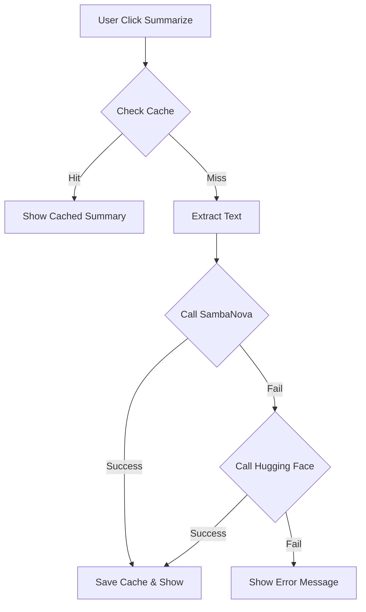

# UC18 - TÓM TẮT NỘI DUNG (AI SUMMARY)

## 1. THÔNG TIN CƠ BẢN

- **Mã UC:** UC18
- **Tên:** Tóm tắt nội dung trang bằng AI
- **Mô tả:** Sử dụng SambaNova AI (Llama 3.1) để tóm tắt nội dung document, với cơ chế dự phòng bằng Hugging Face.
- **Actor:** User (Authenticated)
- **Precondition:** 
  - User đã đăng nhập
  - Document có nội dung (min 100 chars)
  - SambaNova API key đã được cấu hình (cho ưu tiên 1)
- **Postcondition:** Summary được hiển thị và cache
- **Trạng thái:** ✅ Đã triển khai
- **Ưu tiên:** 🟡 TRUNG BÌNH
- **Dependencies:** 
  - ✅ Authentication (UC01-UC06)
  - ✅ Documents (UC07-UC13)
- **Tech Stack:** Convex, SambaNova API, Hugging Face API, React, TypeScript

---

## 2. LUỒNG XỬ LÝ

### Main Flow: Tóm tắt nội dung

1. User mở document
2. System hiển thị nút "Tóm tắt AI"
3. User click nút "Tóm tắt AI"
4. System kiểm tra cache (content hash)
5. Nếu có cache → Hiển thị summary từ cache
6. Nếu không có cache:
   - System extract plain text từ BlockNote content
   - **Bước 6a:** System gọi **SambaNova API** (Meta-Llama-3.1-8B-Instruct)
   - **Bước 6b (Fallback):** Nếu SambaNova thất bại, System gọi **Hugging Face API** (Facebook BART Large CNN)
   - System lưu summary vào cache (kèm thông tin model đã dùng)
   - System hiển thị summary
7. User có thể copy summary

### Alternative Flow 1: Regenerate summary

6a. User click "Tạo lại"
7a. System force gọi API (bỏ qua cache)
8a. Continue từ step 6

### Alternative Flow 2: Content quá ngắn

4a. Nếu content < 100 chars
5a. System show error "Nội dung quá ngắn để tóm tắt"
6a. End

### Exception Flow

- 6c. Nếu cả 2 API đều lỗi → Show error "Hệ thống AI đang bận, vui lòng thử lại sau"
- *. Nếu unauthorized → Redirect to login

---

## 3. BIỂU ĐỒ HOẠT ĐỘNG



---

## 4. DATABASE SCHEMA

### 4.1. AI Summaries Table

```typescript
// convex/schema.ts
export default defineSchema({
  // ... existing tables ...
  
  aiSummaries: defineTable({
    documentId: v.id("documents"),       // Link to document
    userId: v.string(),                  // Owner
    summary: v.string(),                 // AI-generated summary
    contentHash: v.string(),             // Hash of content to detect changes
    model: v.string(),                   // Model used: "sambanova/..." or "huggingface/..."
    createdAt: v.number(),
  })
    .index("by_document", ["documentId"])
    .index("by_user", ["userId"])
    .index("by_document_hash", ["documentId", "contentHash"]),
});
```

---

## 5. API ENDPOINTS

### 5.1. Summarize Document Implementation

```typescript
// convex/ai.ts
// ... imports ...

export const summarizeDocument = action({
  // ... args ...
  handler: async (ctx, args) => {
    // ... auth checks ...

    // 1. Try SambaNova first
    const sambaNovaApiKey = process.env.SAMBANOVA_API_KEY;
    if (sambaNovaApiKey) {
      try {
        summary = await summarizeWithSambaNova(plainText, sambaNovaApiKey);
        usedModel = "sambanova/meta-llama-3.1-8b-instruct";
      } catch (error) {
        // Log error and continue to fallback
      }
    }

    // 2. Fallback to Hugging Face
    if (!summary) {
      try {
        summary = await summarizeWithHuggingFace(plainText);
        usedModel = "huggingface/facebook-bart-large-cnn";
      } catch (error) {
         throw new Error("Không thể tạo tóm tắt. Cả SambaNova và Hugging Face đều gặp lỗi.");
      }
    }
    
    // ... cache result ...
  },
});
```

---

## 6. VALIDATION RULES

| Field | Rule | Error Message |
|-------|------|---------------|
| Content | Min 100 chars | "Nội dung quá ngắn để tóm tắt" |
| API Success | At least one API works | "Không thể kết nối đến hệ thống AI" |
| Document | Must exist and owned by user | "Không có quyền truy cập" |

---

## 7. ERROR HANDLING

| Error Code | Condition | Message | Action |
|------------|-----------|---------|--------|
| `NOT_AUTHENTICATED` | User not logged in | "Vui lòng đăng nhập" | Redirect to login |
| `API_ERROR` | All APIs failed | "AI đang bận, thử lại sau nhé" | Show toast |

---

## 8. TEST CASES & PERFORMANCE

- **Accuracy:** SambaNova Llama 3.1 cho kết quả tóm tắt thông minh hơn so với các model nhỏ.
- **Latency:**
  - SambaNova: ~2-4s
  - Hugging Face: ~3-5s (Cold booth có thể lâu hơn)
- **Cost:**
  - SambaNova: Free tier ($5 credit/month)
  - Hugging Face: Free inference API

---

**Cập nhật:** 25/12/2025
**Trạng thái:** Hoàn tất chuyển đổi từ Gemini sang SambaNova + HF.
