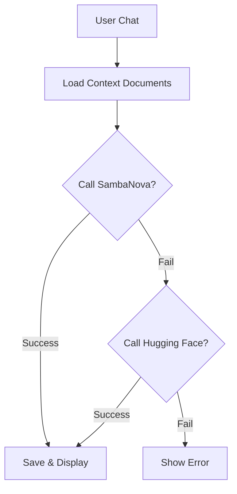

# UC19 - HỎI ĐÁP AI (AI CHAT)

## 1. THÔNG TIN CƠ BẢN

- **Mã UC:** UC19
- **Tên:** Hỏi đáp AI về nội dung trang
- **Mô tả:** Chat với AI (SambaNova Llama 3.1) để hỏi đáp, giải thích về nội dung document, có cơ chế dự phòng HF.
- **Actor:** User (Authenticated)
- **Precondition:** 
  - User đã đăng nhập
  - Document có nội dung
  - SambaNova API key đã được cấu hình
- **Postcondition:** Chat history được lưu
- **Trạng thái:** ✅ Đã triển khai
- **Ưu tiên:** 🟡 TRUNG BÌNH
- **Dependencies:** 
  - ✅ Authentication (UC01-UC06)
  - ✅ Documents (UC07-UC13)
- **Tech Stack:** Convex, SambaNova API (Llama 3.1), Hugging Face (Fallback), React

---

## 2. LUỒNG XỬ LÝ

### Main Flow: Chat với AI

1. User mở document
2. System hiển thị nút "Hỏi AI" (hoặc Chat Icon)
3. User click nút "Hỏi AI" → Mở Sidebar Chat
4. System load chat history (nếu có)
5. User nhập câu hỏi (VD: "Giải thích phần đầu")
6. User click "Gửi"
7. System tạo `chatSession` (nếu chưa có)
8. System gửi: [System Prompt + Document Context + History + Câu hỏi] đến **SambaNova API**
9. **Bước 9a:** Nếu SambaNova thành công → Trả về câu trả lời.
10. **Bước 9b (Fallback):** Nếu lỗi, gọi **Hugging Face API** (DialogGPT/Conversational model).
11. System lưu câu hỏi và câu trả lời vào bảng `chatMessages`.
12. System hiển thị câu trả lời trên giao diện.

### Alternative Flow 1: New conversation

5a. User click "Cuộc trò chuyện mới"
6a. System tạo session mới (hoặc clear UI)
7a. Continue từ step 5

### Exception Flow

- 8a. Nếu cả 2 API đều lỗi → Show error "Hệ thống đang bận"
- *. Nếu unauthorized → Redirect to login

---

## 3. BIỂU ĐỒ HOẠT ĐỘNG



---

## 4. DATABASE SCHEMA

### 4.1. Chat Tables (New)

```typescript
// convex/schema.ts

// 1. Quản lý phiên chat (theo document)
chatSessions: defineTable({
  userId: v.string(),
  documentId: v.id("documents"),
  title: v.optional(v.string()), // Tự động đặt tên sau câu hỏi đầu
  createdAt: v.number(),
}).index("by_user_document", ["userId", "documentId"]),

// 2. Lưu nội dung tin nhắn
chatMessages: defineTable({
  sessionId: v.id("chatSessions"),
  role: v.string(),     // "user" | "assistant"
  content: v.string(),
  model: v.string(),    // "sambanova/..." | "huggingface/..."
  createdAt: v.number(),
}).index("by_session", ["sessionId"]),
```

---

## 5. API ENDPOINTS

### 5.1. Chat Implementation

```typescript
// convex/ai.ts
export const chatWithAI = action({
  // ... args ...
  handler: async (ctx, args) => {
    // ... auth & doc checks ...

    // 1. Get/Create Session
    let sessionId = args.sessionId;
    if (!sessionId) {
       sessionId = await ctx.runMutation(internal.ai.createChatSession, ...);
    }
    
    // 2. Get Context
    const docContext = extractPlainText(doc.content);
    
    // 3. Call AI (SambaNova -> HF)
    const response = await chatWithSambaNova(args.message, docContext, history, key);
    // ... fallback logic internally ...

    // 4. Save Messages
    await ctx.runMutation(internal.ai.saveChatMessage, {
       sessionId,
       role: "user",
       content: args.message
    });
    
    await ctx.runMutation(internal.ai.saveChatMessage, {
       sessionId,
       role: "assistant", 
       content: response
    });
    
    return { response };
  }
});
```

---

## 6. UI COMPONENTS

- **ChatInterface:** Dialog/Sidebar hiển thị tin nhắn.
- **MessageBubble:** Hiển thị tin nhắn User (xanh) và AI (xám).
- **FallbackIndicator:** Hiển thị icon nhỏ nếu dùng Model dự phòng.

## 7. ERROR HANDLING

| Error | Message |
|-------|---------|
| All APIs Fail | "Hệ thống AI tạm thời không khả dụng." |
| Context Too Long | "Tài liệu quá dài, chỉ xử lý 8000 ký tự đầu." |

---

**Cập nhật:** 25/12/2025
**Trạng thái:** Hoàn tất.
