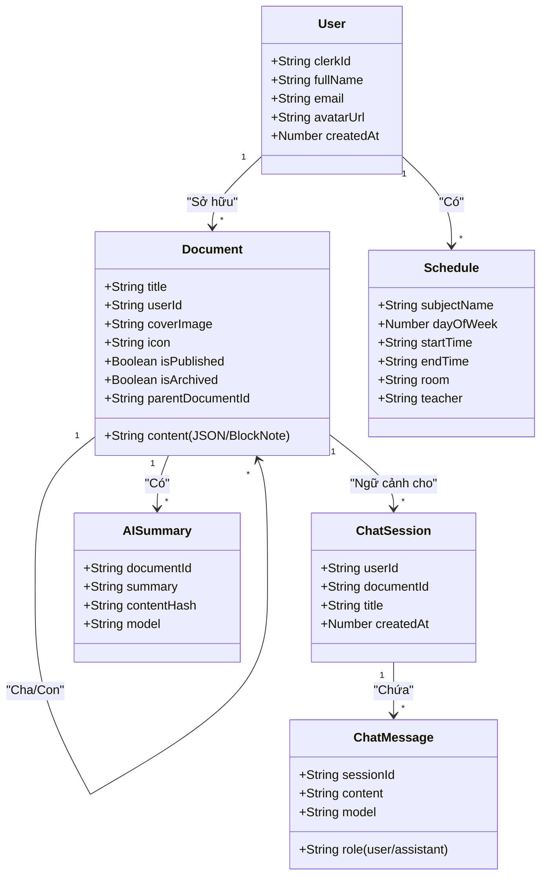
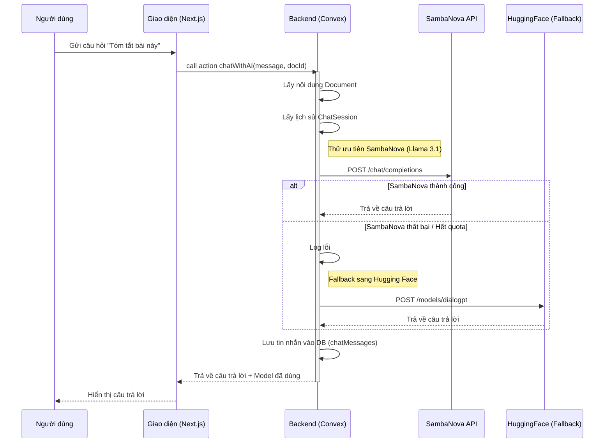
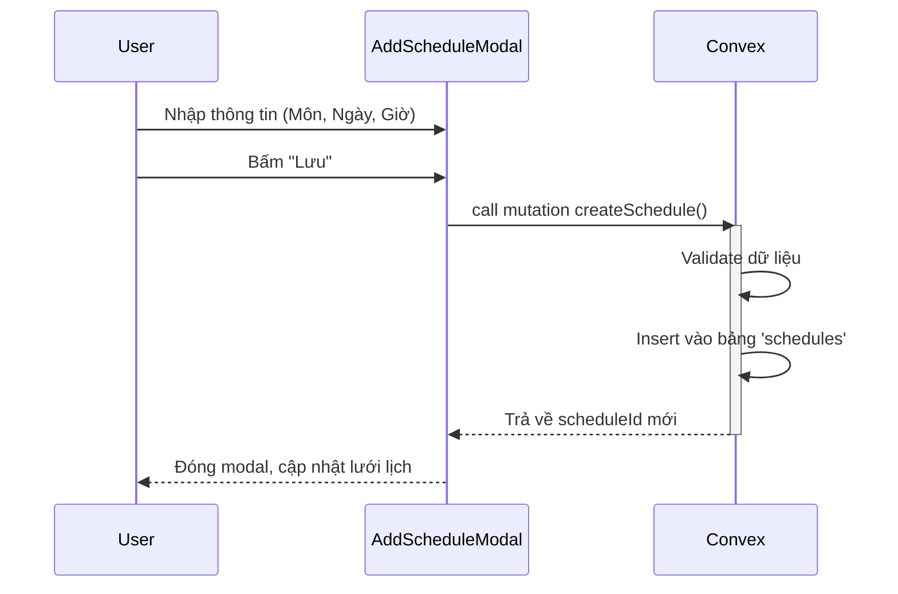

# CÁC BIỂU ĐỒ UML CHO BÁO CÁO (CẬP NHẬT THEO CODEBASE THỰC TẾ)

Tài liệu này chứa mã nguồn Mermaid cho các biểu đồ UML cần thiết để đưa vào báo cáo. Bạn có thể copy mã này vào [Mermaid Live Editor](https://mermaid.live/) để xuất ra hình ảnh chất lượng cao.

## 1. Biểu đồ Use Case (Use Case Diagram)

Cập nhật để phản ánh đúng các chức năng hiện có trong `plms-deploy`, bao gồm quản lý tài liệu, lịch học, và tính năng AI mới (SambaNova/HuggingFace).

```mermaid
usecaseDiagram
    actor "Người dùng (User)" as U
    actor "Hệ thống (System)" as S
    actor "SambaNova / HuggingFace" as AI
    actor "Clerk Auth" as Auth

    package "Hệ thống PLMS" {
        usecase "Đăng nhập / Đăng ký" as UC1
        usecase "Quản lý Tài liệu (BlockNote)" as UC2
        usecase "Quản lý Lịch học" as UC3
        usecase "Tóm tắt tài liệu bằng AI" as UC4
        usecase "Chat với tài liệu (AI)" as UC5
        usecase "Quản lý Bảng dữ liệu" as UC6
        usecase "Nhận thông báo" as UC7
    }

    U --> UC1
    U --> UC2
    U --> UC3
    U --> UC4
    U --> UC5
    U --> UC6
    U --> UC7

    UC1 ..> Auth : "Xác thực"
    UC4 ..> AI : "Gửi context tài liệu"
    UC5 ..> AI : "Hỏi đáp ngữ cảnh"
```

## 2. Biểu đồ Lớp (Class Diagram)

Dựa trên `convex/schema.ts`, phản ánh chính xác các bảng dữ liệu thực tế đang chạy trên Convex.



## 3. Biểu đồ Tuần tự (Sequence Diagrams)

### 3.1. Luồng Chat với AI (Cập nhật logic SambaNova -> HuggingFace)

Đây là logic quan trọng vừa được refactor trong `convex/ai.ts`.



### 3.2. Luồng Tạo Lịch học



## 4. Biểu đồ Hoạt động (Activity Diagram)

Mô tả chi tiết giải thuật xử lý AI Fallback trong `summarizeDocumentHandler`.

```mermaid
flowchart TD
    A[Bắt đầu Tóm tắt] --> B{Kiểm tra Cache?}
    B -- Có cache & Hash khớp --> C[Trả về kết quả từ Cache]
    B -- Không có / Force Regenerate --> D[Lấy nội dung Document]
    
    D --> E{Có API Key SambaNova?}
    E -- Có --> F[Gọi SambaNova API]
    E -- Không --> G
    
    F --> H{Thành công?}
    H -- OK --> I[Lưu kết quả + Model 'SambaNova']
    H -- Lỗi --> G[Gọi HuggingFace API (Fallback)]
    
    G --> J{Thành công?}
    J -- OK --> K[Lưu kết quả + Model 'HuggingFace']
    J -- Lỗi --> L[Throw Error: Hệ thống bận]
    
    I --> M[Lưu vào bảng aiSummaries]
    K --> M
    M --> N[Trả về kết quả cho Client]
    C --> N
    N --> O[Kết thúc]
```

## 5. Biểu đồ Triển khai (Deployment Diagram)

Thể hiện kiến trúc hiện đại của dự án (Next.js + Convex).

```mermaid
deploymentDiagram
    node "Client Device" {
        component "Web Browser" as Browser
    }

    node "Vercel Cloud" {
        component "Next.js Frontend" as NextJS
    }

    node "Convex Cloud" {
        database "Realtime Database" as DB
        component "Backend Functions" as Functions
    }

    node "External Services" {
        component "Clerk Auth" as Clerk
        component "EdgeStore (Files)" as EdgeStore
        component "SambaNova AI" as AIService
    }

    Browser -- HTTPS --> NextJS
    NextJS -- HTTPS/WSS --> Functions
    Functions -- Read/Write --> DB
    Browser -- Auth Tokens --> Clerk
    NextJS -- Validate Token --> Clerk
    Functions -- API Call --> AIService
    Browser -- Uploads --> EdgeStore
```
